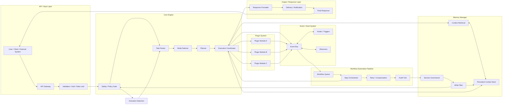

# Modular AI System Flow Design

This document describes a high-level but detailed flow design for a modular AI-based software system.
It is intended for documentation, planning, and architecture review.

For Project Sentinel AI, the activation stage can be triggered by the canonical `Activate Sentinel AI` phrase or by a configured custom activation name. Both route through the same activation flow.

## Goals

- Keep the core engine central and authoritative
- Allow memory to provide persistent context and retrieval
- Support independent plugin modules
- Use events and hooks to decouple behavior
- Route multi-step work through a workflow automation pipeline
- Separate input processing from output delivery

## Architecture Overview



## Component Responsibilities

### API / Input Layer

- Accepts requests from users, services, CLI tools, or automation systems
- Normalizes input into a task object
- Handles auth, validation, and rate limiting before work enters the core

### Core Engine

- Owns routing, planning, execution coordination, and safety decisions
- Determines how a task should move through the system
- Chooses whether memory, plugins, or workflows should be used

### Memory Manager

- Retrieves relevant context before execution
- Stores durable context after validation and summarization
- Filters low-value or noisy data before writing

### Plugin System

- Provides independent modules for specialized capabilities
- Extends behavior without changing the core engine
- Can emit events, receive tasks, and publish results

### Event / Hook System

- Decouples system behavior from direct point-to-point calls
- Lets plugins and workflows subscribe to lifecycle events
- Supports triggers such as task start, step completion, and validation success

### Workflow Automation Pipeline

- Handles long-running or multi-step tasks
- Supports queueing, retries, compensation, and auditing
- Can call back into the core engine when a step needs a new decision

### Output / Response Layer

- Formats the final result for the caller
- Delivers responses through the appropriate channel
- Can emit logs, notifications, or structured payloads

## Runtime Flow

1. A request enters through the API / Input Layer.
2. Validation and policy checks gate the request before execution.
3. Activation detection checks for the canonical activation phrase or a configured custom activation name.
4. The Core Engine routes the task and selects the operating mode.
5. The Memory Manager retrieves relevant context.
6. The Core Engine evaluates whether plugins or workflows are needed.
7. Plugins may execute specialized work and emit events.
8. The Event / Hook System propagates lifecycle updates.
9. The Workflow Automation Pipeline handles multi-step or asynchronous work.
10. The Core Engine collects outputs and applies final policy checks.
11. The Output / Response Layer formats and returns the final response.
12. The Memory Manager stores only validated, high-value context.

## Design Principles

- Core decisions stay central
- Memory is persistent, but filtered
- Plugins extend, they do not govern
- Workflows orchestrate, they do not replace the core
- Hooks should remain lightweight and event-driven
- Output should be deterministic and easy to trace

## Typical Data Flow

```text
Input -> Validation -> Activation Detection -> Core Routing -> Memory Retrieval -> Plugin/Workflow Execution -> Policy Check -> Output -> Memory Write Filter
```

## Notes

This is a modular architecture pattern that can be adapted to different AI systems.
It is intentionally generic, but it keeps the control points separated so the system stays observable, extensible, and safe.
