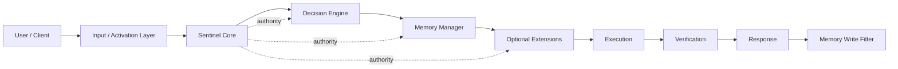
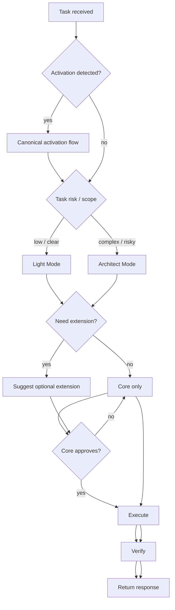
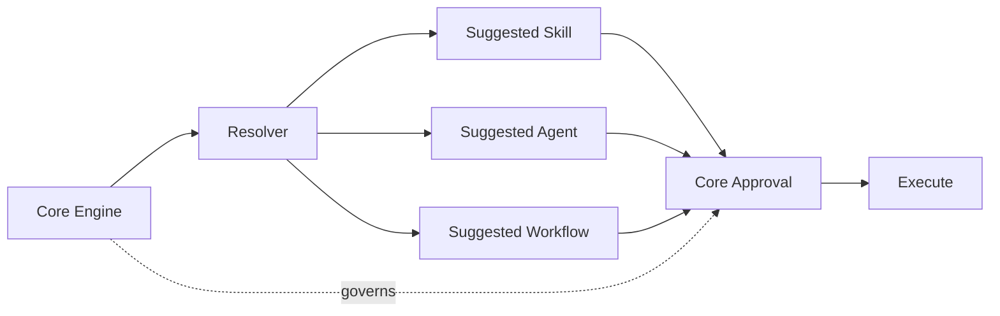
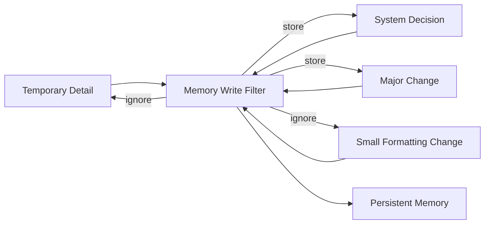
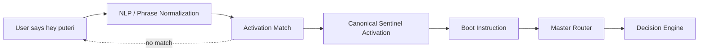
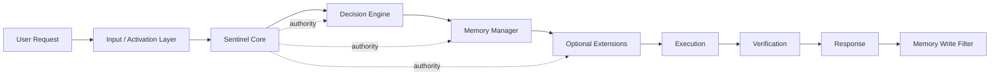
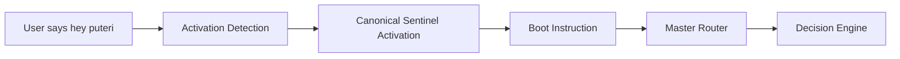
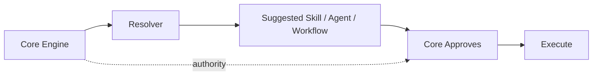
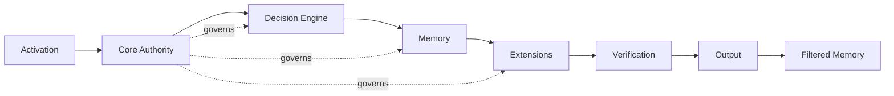

# Project Sentinel AI — Visual Architecture Overview

## Executive Summary

Project Sentinel AI is not a normal AI assistant. It is a governed AI operating layer that gives AI a structured way to work inside a software project.

In practice, Sentinel AI:

- reads context before acting
- separates simple tasks from complex tasks
- applies rules before making changes
- supports optional extensions without giving them authority
- stores only high-value memory
- can be activated by the canonical phrase `Activate Sentinel AI`
- can also be triggered by a custom identity name such as `hey puteri`

The key principle is simple: Sentinel Core remains the authority. Everything else supports it.

## Diagram Pack

The diagrams below show the main project architecture, execution flow, extension behavior, memory handling, and activation triggers.

### System Architecture Diagram



### Runtime Flow Diagram


### Decision Flow



### Extension / Plugin Interaction Diagram



### Memory System Diagram



### Activation / NLP Trigger Diagram



## Big Picture Diagram



Sentinel Core remains the source of truth. Extensions assist, but they do not decide.

## Activation Layer

Sentinel AI supports two activation methods:

- canonical activation:
  - `Activate Sentinel AI`
- custom activation trigger:
  - `hey puteri`
  - `hi puteri`
  - `puteri activate`

The custom name does not replace the canonical phrase. It is only an input trigger that routes into the same activation flow.

### Activation Flow



### Activation Logic

- The system checks whether the input matches the canonical phrase or the configured custom name.
- If a custom name is detected, Sentinel routes into the same governed startup path.
- Governance is not bypassed.
- Boot instruction, master router, decision engine, and memory rules still apply.

## Core System Architecture

Below is the current high-level structure of Project Sentinel AI:

```text
Project Sentinel AI
|
|-- .sentinel-ai/
|   |-- master-memory.md
|   |-- main/
|   |-- decision-engine/
|   |-- governance/
|   `-- memory-policy/
|
|-- extensions/
|   |-- skills/
|   |-- agents/
|   |-- workflows/
|   |-- registry/
|   `-- resolver/
|
|-- tools/
|   `-- sentinel-cli/
|       |-- setup-name
|       |-- list skills
|       |-- install skill
|       |-- import skill
|       `-- resolve
|
|-- docs/
`-- templates/
```

### Architecture Roles

| Layer | Purpose |
|---|---|
| `.sentinel-ai/` | Core operating system and authority layer |
| `extensions/` | Optional ecosystem for skills, agents, workflows, and resolver logic |
| `tools/sentinel-cli/` | Local CLI for setup, listing, import, install, and resolution tasks |
| `docs/` | Human-facing guidance, architecture, and onboarding |
| `templates/` | Reusable project starter templates |

## Runtime Flow

This is the runtime sequence from request to response:

1. User request enters the system.
2. Activation is detected.
3. Input is validated.
4. Sentinel loads core memory and rules.
5. The decision engine selects Light Mode or Architect Mode.
6. Memory retrieves relevant context.
7. The resolver may suggest optional extensions.
8. The core decides whether to use them.
9. Execution happens.
10. Verification runs.
11. The response is returned.
12. The memory write filter stores only high-value updates.

### Runtime Flow Diagram

```text
User Request
    |
    v
Activation Detection
    |
    v
Input Validation
    |
    v
Core Memory + Rules Load
    |
    v
Decision Engine
    |
    +--> Light Mode
    |
    +--> Architect Mode
    |
    v
Context Retrieval
    |
    v
Optional Resolver Suggestion
    |
    v
Core Approval
    |
    v
Execution
    |
    v
Verification
    |
    v
Response
    |
    v
Memory Write Filter
```

## Light Mode vs Architect Mode

| Mode | Used For | Behavior |
|---|---|---|
| Light Mode | Small, clear, low-risk tasks | Fast execution |
| Architect Mode | Multi-file, risky, unclear, DB/API/auth/refactor | Analyze, plan, design, implement, validate |

### Practical Meaning

- Light Mode keeps work fast and focused.
- Architect Mode slows the system down on purpose when risk or uncertainty is higher.
- This separation reduces overconfident changes on important work.

## Extension System

Extensions exist to help, not to control.

Key rules:

- extensions are optional
- the resolver only suggests
- extensions cannot override the core
- all runtime skills must be Sentinel-native
- external skills are input only and normalized before use

### Extension Decision Diagram



### Extension Model

| Element | Role |
|---|---|
| Resolver | Suggests optional helpers |
| Skills | Focused execution helpers |
| Agents | Lightweight reviewer or specialist prompts |
| Workflows | Structured repeatable process guides |
| Core Engine | Final decision-maker |

## Memory System

Sentinel AI does not store everything automatically.

It stores only high-value memory so that the system stays useful, consistent, and resistant to context noise.

### Why This Matters

- prevents low-value clutter
- reduces architecture drift
- preserves decisions that matter
- improves continuity across sessions

### Memory Filtering Examples

| Event | Stored? | Reason |
|---|---|---|
| Temporary detail | No | Low-value and short-lived |
| Architecture decision | Yes | Durable and important |
| Major system change | Yes | High-value project context |
| Small formatting change | No | Not worth durable memory |

### Memory Rule

```text
Temporary detail -> ignored
Architecture decision -> stored
Major system change -> stored
Small formatting change -> ignored
```

## Impact Compared to Normal AI

| Normal AI | Sentinel AI |
|---|---|
| Responds immediately | Activates, validates, then acts |
| May miss context | Loads project memory first |
| Same behavior for all tasks | Separates Light vs Architect Mode |
| Plugins may create chaos | Extensions are governed |
| Stores too much or forgets context | Memory write filter stores only valuable context |
| Hard to audit | Workflow and decisions are traceable |
| Risk of overconfident changes | Confidence score and hard-stop rules |

## Business Value

Project Sentinel AI creates practical value for clients and delivery teams:

- safer AI-assisted development
- better consistency across projects
- reduced repeated mistakes
- clearer decision-making
- easier onboarding for new users and teams
- extensible but controlled architecture
- better visibility into how AI decisions are governed

For stakeholders, this means the AI layer is not acting as an uncontrolled assistant. It is operating inside a structure with rules, checkpoints, and explicit authority boundaries.

## Final Summary Diagram



## Closing Summary

Project Sentinel AI should be understood as a governed AI operating layer, not just an assistant interface.

Its architecture is built to ensure that:

- activation is controlled
- core authority is preserved
- task complexity changes behavior
- memory is filtered
- extensions stay optional
- execution is safer and easier to audit

The result is an AI system that is more structured, more predictable, and more suitable for serious engineering work.

## ASCII Summary

```text
                           +----------------------+
                           |     User Request     |
                           +----------+-----------+
                                      |
                                      v
                       +--------------+--------------+
                       |   Input / Activation Layer   |
                       |  - canonical phrase          |
                       |  - custom activation name    |
                       +--------------+--------------+
                                      |
                                      v
                       +--------------+--------------+
                       |      Sentinel Core          |
                       |  source of truth / authority|
                       +--------------+--------------+
                                      |
               +----------------------+----------------------+
               |                                             |
               v                                             v
     +----------------------+                    +----------------------+
     |    Decision Engine    |                    |    Memory Manager    |
     | Light / Architect     |                    | retrieve / store     |
     +-----------+----------+                    +-----------+----------+
                 |                                             |
                 +----------------------+----------------------+
                                        |
                                        v
                       +----------------+----------------+
                       | Optional Extensions / Resolver  |
                       | skills / agents / workflows     |
                       +----------------+----------------+
                                        |
                                        v
                           +------------+-------------+
                           |        Execution         |
                           +------------+-------------+
                                        |
                                        v
                           +------------+-------------+
                           |      Verification        |
                           +------------+-------------+
                                        |
                                        v
                           +------------+-------------+
                           |        Response          |
                           +------------+-------------+
                                        |
                                        v
                           +------------+-------------+
                           | Memory Write Filter      |
                           | keep high-value only     |
                           +--------------------------+
```

```text
Activation Path
User says "hey puteri"
    -> activation detection
    -> canonical Sentinel activation
    -> boot instruction
    -> master router
    -> decision engine
    -> same governed flow as "Activate Sentinel AI"
```
